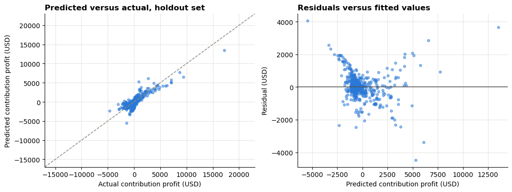

# Recorded Results

## Provenance of Every Number on This Page

Every figure below is transcribed from the __recorded execution of the source
notebook against the real dataset__. That execution produced the outputs stored
in the notebook that this repository was built from.

The results were __not__ recomputed while building this repository, because the
five source files were not available. They must therefore be read as a record of
what the original run produced, not as output verified here.

What was verified while building this repository:

- Every total on this page reconciles arithmetically against the others. The
  checks are listed under "Internal Consistency Checks" below.
- The refactored implementation in `src/portfolio_profitability/` computes each
  quantity by the same definitions, and is covered by 127 passing tests.
- The notebook executes from a clean kernel with no manual intervention.

What was __not__ verified:

- That re-running against the real files reproduces these exact numbers. That
  requires the files.

Nothing on this page was estimated, rounded up, inferred, or filled in. Where a
value was not recorded, this page says so.

## Environment of the Recorded Run

| Item | Value |
|---|---|
| pandas | 2.2.2 |
| numpy | 1.26.4 |
| Random seed | 42 |
| Holdout proportion | 0.25 |

The recorded run did not print its Python, scikit-learn, statsmodels, or
matplotlib versions, so those are unknown. The refactored notebook prints all of
them, so a future run will not have this gap.

## Data Quality Profile

| Table | Rows | Columns |
|---|---|---|
| customers | 11,904 | 9 |
| order_items | 26,072 | 7 |
| orders | 11,904 | 8 |
| products | 1,990 | 10 |
| sellers | 500 | 8 |

Missing values:

| Table | Column | Missing | Share |
|---|---|---|---|
| order_items | `order_no` | 100 | 0.38% |
| orders | `order_delivered_carrier_date` | 789 | 6.63% |
| orders | `order_delivered_customer_date` | 789 | 6.63% |
| products | `cost` | 99 | 4.97% |

No table contained an exact duplicate row. Referential integrity: 25,972 of
26,072 order lines resolved to an order, leaving 0.38% unmatched, which is
exactly the 100 rows with a null order key.

## Cleansing Outcomes

| Step | Outcome |
|---|---|
| Removed order lines with no parent order | 100 rows removed, 0.38%. 25,972 retained. |
| Imputed missing product cost | 99 values imputed, 4.97% of products. |

Effect of imputation on the cost distribution:

| Statistic | Before | After |
|---|---|---|
| Mean cost | 222.70 | 223.61 |
| Median cost | 72.50 | 71.16 |

Category median cost used for the imputation:

| Category | Median cost |
|---|---|
| auto | 193.82 |
| books | 17.73 |
| electronics | 906.15 |
| fashion | 51.43 |
| furniture | 321.87 |
| home_goods | 54.22 |
| toys | 20.98 |

## Fact Table

Purchase dates spanned 2019-01-01 to 2025-12-31 with zero unparsed timestamps.
The joined fact table held 25,972 order lines: 24,231 delivered and 1,741
cancelled.

## Portfolio Financial Totals, Delivered Order Lines Only

| Measure | Amount | Note |
|---|---|---|
| Delivered order lines | 24,231 | |
| Cancelled order lines | 1,741 | 890,080.25 not recognised |
| Net revenue | 10,636,275.41 | |
| Cost of goods sold | 7,852,536.89 | |
| Gross profit | 2,783,738.52 | 26.17% margin |
| Freight cost | 2,639,540.99 | 24.82% of revenue |
| Contribution profit | 144,197.53 | 1.36% margin |

Freight consumed 94.8 percent of gross profit. That single relationship is the
finding the whole analysis rests on.

## Category Summary

| Category | Units | Revenue | Gross profit | Freight | Contribution profit | Gross margin | Contribution margin | Revenue share |
|---|---|---|---|---|---|---|---|---|
| electronics | 7,453 | 7,870,726.30 | 1,468,894.50 | 798,540.07 | 670,354.43 | 18.66% | 8.52% | 74.00% |
| furniture | 2,154 | 1,192,822.99 | 486,939.82 | 259,133.45 | 227,806.37 | 40.82% | 19.10% | 11.21% |
| fashion | 5,400 | 767,597.57 | 483,928.87 | 579,389.69 | -95,460.82 | 63.04% | -12.44% | 7.22% |
| home_goods | 3,506 | 375,693.01 | 184,517.91 | 379,732.14 | -195,214.23 | 49.11% | -51.96% | 3.53% |
| auto | 855 | 229,741.39 | 57,786.27 | 96,381.14 | -38,594.87 | 25.15% | -16.80% | 2.16% |
| toys | 2,704 | 136,927.42 | 76,575.60 | 294,778.98 | -218,203.38 | 55.92% | -159.36% | 1.29% |
| books | 2,159 | 62,766.73 | 25,095.55 | 231,585.52 | -206,489.97 | 39.98% | -328.98% | 0.59% |

Only electronics and furniture were contribution positive. The other five
categories lost money after fulfillment was charged against them.

## Freight and Product Size

Correlation of `freight_value` with:

| Attribute | Correlation |
|---|---|
| Product weight | +0.070 |
| Product volume | +0.022 |
| Product price | -0.003 |

Average freight by weight band:

| Band | Units | Average freight |
|---|---|---|
| 0-500 g | 4,903 | 107.19 |
| 501-1,000 g | 7,165 | 108.02 |
| 1,001-5,000 g | 9,354 | 107.56 |
| 5,001-15,000 g | 947 | 108.56 |
| Above 15,000 g | 1,862 | 124.09 |

Portfolio mean freight per unit: 108.93.

__Correction to the original interpretation.__ The source notebook described
average freight as flat across weight bands. It is flat across the four bands
below fifteen kilograms, which span 107.19 to 108.56, a range of 1.3 percent.
Above fifteen kilograms it rises to 124.09, which is 15.2 percent above the
lowest band. The accurate statement is that freight is effectively a fixed
charge per item below fifteen kilograms and steps up above it.

## Model

1,988 products had at least one delivered sale. The design matrix was 1,988 rows
by 10 columns, with `auto` as the dropped baseline category. The split gave
1,491 training products, 75 percent, and 497 holdout products, 25 percent.

Intercept: -1,326.44

| Variable | Coefficient | Standard error | t | p |
|---|---|---|---|---|
| const | -1,326.4379 | 84.467 | -15.704 | 0.000 |
| `unit_gross_margin` | 16.4872 | 0.281 | 58.693 | 0.000 |
| `weight_g` | 0.0067 | 0.004 | 1.532 | 0.126 |
| `volume_cm3` | -0.0028 | 0.002 | -1.681 | 0.093 |
| `avg_discount_rate` | -3,425.0214 | 2,821.444 | -1.214 | 0.225 |
| `cat_books` | 476.4197 | 101.425 | 4.697 | 0.000 |
| `cat_electronics` | 461.3859 | 101.380 | 4.551 | 0.000 |
| `cat_fashion` | -413.0347 | 243.767 | -1.694 | 0.090 |
| `cat_furniture` | -1,788.2889 | 130.997 | -13.651 | 0.000 |
| `cat_home_goods` | -216.6982 | 94.849 | -2.285 | 0.022 |
| `cat_toys` | 45.0188 | 103.254 | 0.436 | 0.663 |

Model level statistics: F = 554.5 on 10 and 1,480 degrees of freedom, with
Prob(F) below 0.001. Log likelihood -12,287. AIC 2.460e+04. BIC 2.465e+04.

## Performance

| Metric | Training | Holdout |
|---|---|---|
| R squared | 0.789 | 0.773 |
| Adjusted R squared | 0.788 | Not applicable |
| RMSE | 917.689 | 802.879 |
| MAE | 568.349 | 527.883 |

Five fold cross validation over all 1,988 products: mean R squared 0.779,
standard deviation 0.023. Fold scores 0.783, 0.771, 0.751, 0.770, 0.821.

Target standard deviation 1,927.49. Holdout MAE was 27.4 percent of that spread.

Adjusted R squared is undefined on a holdout set, where the model consumed no
degrees of freedom. The source notebook printed `NaN` in that cell. This
repository labels it "not applicable" instead.

## Directional Accuracy

The source notebook reported one figure, __90.29 percent__, computed across all
1,988 products. That set includes the 1,491 products the model was fitted on, so
the figure is optimistically biased and is not a holdout result.

| Scope | Products | Actually loss making | Flagged loss making | Accuracy |
|---|---|---|---|---|
| Full sample, as originally reported | 1,988 | 1,371 (68.96%) | 1,336 | 90.29% |
| Holdout only | 497 | Not recorded | Not recorded | __Not recorded__ |

__The holdout directional accuracy was never computed in the recorded run, so
it is unknown.__ It is not estimated here. The refactored notebook computes and
reports both figures, so a future run against the source files will fill this
gap. Any statement of the form "the model calls the direction correctly about
nine times in ten on unseen products" is unsupported by the recorded evidence.

Portfolio concentration, across all 1,988 products:

| Measure | Value |
|---|---|
| Products that are contribution positive | 31.04% (617 of 1,988) |
| Share of revenue earned by those products | 81.32% |

## Residual Diagnostics

| Statistic | Value |
|---|---|
| Omnibus | 619.470 |
| Prob(Omnibus) | 0.000 |
| Skew | 1.170 |
| Kurtosis | 24.968 |
| Jarque-Bera | 30,322.195 |
| Prob(JB) | 0.000 |
| Durbin-Watson | 1.945 |
| Condition number | 2.93e+06 |

Residuals are strongly non normal. Ordinary least squares point estimates remain
unbiased, but the p values and confidence intervals above rest on an assumption
the data does not meet and should be read as indicative.

## Variance Inflation Factors

| Variable | VIF |
|---|---|
| `unit_gross_margin` | 1.88 |
| `weight_g` | 3.79 |
| `volume_cm3` | 1.59 |
| `avg_discount_rate` | 10.53 |
| `cat_books` | 2.33 |
| `cat_electronics` | 2.32 |
| `cat_fashion` | 11.65 |
| `cat_furniture` | 3.83 |
| `cat_home_goods` | 1.97 |
| `cat_toys` | 2.12 |

__Correction to the original interpretation.__ The source notebook stated that
the variance inflation factors confirmed no explanatory variable was a near
linear combination of the others, and cited a threshold of 10 in the same cell.
Two variables exceeded that threshold, `avg_discount_rate` at 10.53 and
`cat_fashion` at 11.65, and statsmodels independently flagged a condition number
of 2.93e+06 in the regression output immediately above. The original statement
is contradicted by the output printed beside it.

The accurate statement is that two variables exceed the threshold. For
`cat_fashion` this is expected rather than concerning, because one hot
indicators from a single categorical variable are mutually exclusive and so are
partly predictable from each other by construction. It inflates the standard
errors of the affected terms and does not bias the coefficients. The dominant
term, `unit_gross_margin` at 1.88, is unaffected.

## Recorded Figure

This image is the only figure that survives from the recorded run. It was
extracted from the stored notebook output, so it is genuine output of the real
data rather than a reconstruction. The scatter shows predictions tracking actual
values through the centre of the portfolio and compressing at both tails, and
the residual panel shows the variance widening with the fitted value, which is
the heteroscedasticity the diagnostics above quantify.

Every other figure in `images/` is produced when the pipeline runs against the
source files. See `../images/README.md`.

## Internal Consistency Checks

These were verified arithmetically while writing this page. Each one is a
relationship between numbers recorded independently in different cells, so
agreement is evidence that the recorded outputs are mutually consistent.

| Check | Result |
|---|---|
| Gross profit equals net revenue minus cost of goods sold | 10,636,275.41 - 7,852,536.89 = 2,783,738.52 |
| Contribution profit equals gross profit minus freight | 2,783,738.52 - 2,639,540.99 = 144,197.53 |
| Category contribution profit sums to the portfolio total | Seven categories sum to 144,197.53 |
| Category freight sums to the portfolio total | Seven categories sum to 2,639,540.99 |
| Category units sum to delivered order lines | Seven categories sum to 24,231 |
| Revenue shares sum to 100 percent | 100.00 |
| Gross profit shares sum to 100 percent | 100.00 |
| Weight band units sum to delivered order lines | Five bands sum to 24,231 |
| Portfolio mean freight equals total freight over units | 2,639,540.99 / 24,231 = 108.93 |
| Contribution positive and negative products sum to the total | 617 + 1,371 = 1,988 |
| Gross margin equals gross profit over revenue | 2,783,738.52 / 10,636,275.41 = 26.17% |
| Freight share equals freight over revenue | 2,639,540.99 / 10,636,275.41 = 24.82% |
| Adjusted R squared matches its closed form at n = 1,491 and p = 10 | 0.788 |
| Degrees of freedom reconcile | 1,491 - 10 - 1 = 1,480 |
| Split sizes reconcile | 1,491 + 497 = 1,988 |

Every check passed.
